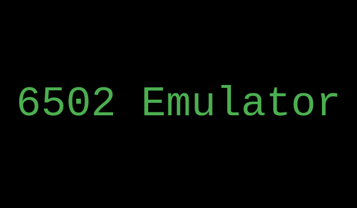

# 6502 Emulator

6502 emulator made in Rust.
## State
Tesed on Windows 10 and Ubuntu 23.10. But should work on any platform, there is no system specific code.

## Usage
- Clone the repo with `git clone https://github.com/griush/6502_emulator.git`.
- Run `cargo run` to start the emulator. You can pass an argument (`cargo run <path>`) to load a custom binary.
